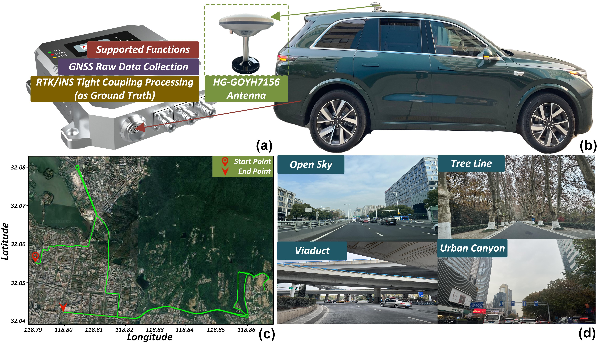

# 🌍 LF-GNSS-Dataset

### 📂 Dataset Overview

**LF-GNSS-Dataset: Satellite Positioning Data for Complex Urban Scenarios**

This dataset is specifically designed for urban environments, featuring long-duration GNSS observations under complex conditions such as non-line-of-sight (NLOS) and multipath effects. It serves as example data to help you get started with [**LF-GNSS**](https://github.com/GarlanLou/LF-GNSS).

You can download the dataset from [this link](https://1drv.ms/f/c/a5d9cc5a4abab336/EmCUwrapp05Gp4Djf3_60pQBINDYJghffWB9bOAikvBWsA?e=pvgLHS).

---

### 📋 Dataset File Description

| **File Name**                | **Description**                                           |
|------------------------------|-----------------------------------------------------------|
| **LF-GNSS_eph.24p**          | GNSS ephemeris data                  |
| **LF-GNSS_groundtruth.txt**  | Ground truth data for evaluation     |
| **LF-GNSS_obs.24o**          | GNSS observation data                |

---

### 📊 Experiment Details

Below are the experiment details, including the platform used for data collection, the experimental route, and the environmental scenarios.

